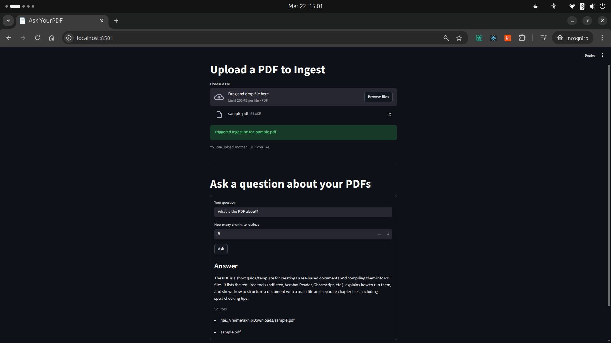
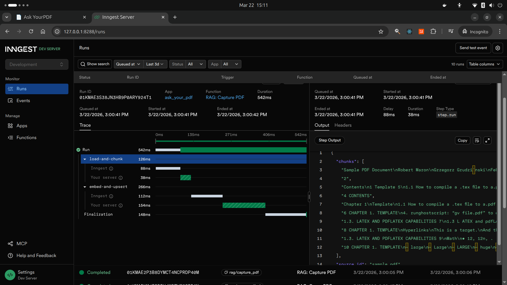
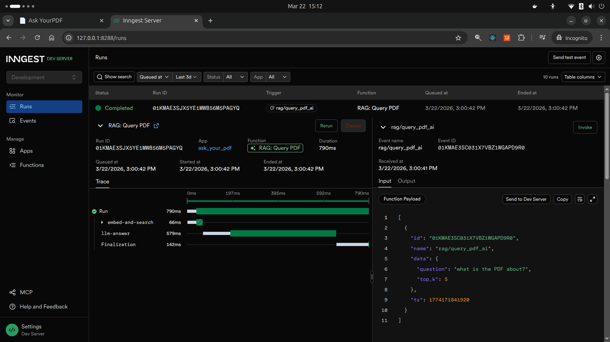

# AskYourPDF



🧠 **Advanced RAG System with Production-Ready AI Pipeline**

A sophisticated Retrieval-Augmented Generation (RAG) application that demonstrates end-to-end AI development capabilities. This system showcases modern AI engineering practices including vector embeddings, semantic search, and LLM integration for intelligent document processing and question answering.

**🚀 AI/ML Technologies:**
- **Vector Embeddings**: Sentence Transformers for semantic text representation
- **Similarity Search**: Cosine similarity with Qdrant vector database
- **Natural Language Processing**: Advanced text chunking and context preservation
- **Large Language Models**: Groq/OpenAI API integration for intelligent responses
- **Event-Driven Architecture**: Inngest for scalable AI workflow orchestration

## 🚀 AI-Powered Features

### 🤖 Core AI Capabilities
- **Semantic Document Understanding**: Advanced NLP for intelligent text comprehension
- **Vector-Based Similarity Search**: Millisecond-scale document retrieval with 384-dimensional embeddings
- **Context-Aware Question Answering**: RAG pipeline with LLM-powered response generation
- **Intelligent Text Chunking**: Preserved context with overlapping window processing

### 🏗️ Engineering Excellence
- **Event-Driven AI Workflows**: Scalable async processing with Inngest orchestration
- **Real-time Pipeline Monitoring**: Comprehensive tracing of AI operations
- **Microservices Architecture**: Separated concerns with FastAPI backend and Streamlit frontend
- **Production-Ready Security**: Environment-based configuration with zero exposed secrets

### 📊 Performance & Scalability
- **Sub-second Search**: Optimized vector indexing for rapid document retrieval
- **Batch Processing**: Efficient embedding generation for multiple documents
- **Memory-Efficient**: Local embedding models with ~90MB footprint
- **Containerized Deployment**: Docker-based vector database for easy scaling

## 🏗️ Architecture

The application consists of several key components:

- **Backend API** (`main.py`): FastAPI server with Inngest functions for PDF processing and querying
- **Frontend** (`fe_streamlit_app.py`): Streamlit web interface for user interaction
- **Data Processing** (`data_loader.py`): PDF parsing, text chunking, and embedding generation
- **Vector Storage** (`vector_db.py`): Qdrant integration for semantic search
- **Type Definitions** (`custom_types.py`): Pydantic models for data validation

## 📋 Prerequisites

- Python 3.12 or higher
- Docker and Docker Compose
- Node.js and npm (for Inngest CLI)
- Git

## 🛠️ Installation & Setup

### 1. Clone the Repository

```bash
git clone <your-repo-url>
cd AskYourPDF
```

### 2. Install Dependencies

Using UV (recommended):

```bash
# Install UV if you haven't already
pip install uv

# Install project dependencies
uv sync
```

Or using pip:

```bash
pip install -r requirements.txt
```

### 3. Environment Configuration

Create a `.env` file in the project root:

```env
# Required: Your AI API key (Groq/OpenAI compatible)
OPENAI_API_KEY=your_api_key_here

# Optional: Environment setting
ENV=development

# Optional: Inngest API base URL (defaults to localhost)
INNGEST_API_BASE=http://127.0.0.1:8288/v1
```

⚠️ **Security Note**: Never commit your `.env` file or expose API keys in your code or documentation.

### 4. Start Qdrant Vector Database

```bash
docker run -d -p 6333:6333 -p 6334:6334 --name qdrant qdrant/qdrant:latest
```

### 5. Start the Backend API

```bash
uv run uvicorn main:app --reload
```

The API will be available at `http://localhost:8000`

### 6. Start Inngest Dev Server

```bash
npx inngest-cli@latest dev -u http://127.0.0.1:8000/api/inngest --no-discovery
```

### 7. Start the Frontend

In a new terminal:

```bash
uv run streamlit run fe_streamlit_app.py
```

The frontend will be available at `http://localhost:8501`

## 🎯 Usage

### 1. Upload PDF Documents

1. Navigate to the Streamlit frontend (`http://localhost:8501`)
2. Use the file uploader to select PDF documents
3. The system will automatically process and index your documents

### 2. Ask Questions

1. Enter your question in the text input field
2. Adjust the number of chunks to retrieve (default: 5)
3. Click "Ask" to get AI-powered answers based on your documents

## 📸 AI Pipeline in Action

### 🎨 User Interface - Streamlit Frontend


**Modern AI-Powered Web Interface:**
- **Clean UX Design**: Intuitive file upload and query interface
- **Real-time Feedback**: Loading states and progress indicators
- **Responsive Layout**: Centered design for optimal user experience
- **File Management**: Secure PDF upload with automatic processing

### 🔄 Document Ingestion Pipeline



**AI-Powered Document Processing Workflow:**
- **Step 1**: PDF upload via Streamlit interface with file validation
- **Step 2**: Automatic text extraction using LlamaIndex PDFReader
- **Step 3**: Intelligent chunking with 1024-character windows and 200-character overlap
- **Step 4**: Vector embedding using Sentence Transformers (all-MiniLM-L6-v2)
- **Step 5**: Storage in Qdrant vector database with cosine similarity search
- **Step 6**: Event-driven processing through Inngest workflows
- **Monitoring**: Real-time pipeline status and error handling

### 🤖 Intelligent Query Processing



**Advanced RAG Architecture in Production:**
- **Step 1**: User question embedding with the same transformer model
- **Step 2**: Semantic similarity search across vector database
- **Step 3**: Context retrieval with top-k most relevant chunks
- **Step 4**: LLM-powered answer generation using Groq/OpenAI API
- **Step 5**: Source attribution and confidence scoring
- **Step 6**: Real-time workflow monitoring via Inngest dashboard
- **Performance**: Sub-second response times with comprehensive logging

### Technical Implementation Highlights

**Machine Learning Components:**
- **Embedding Model**: `all-MiniLM-L6-v2` (384-dimensional vectors)
- **Similarity Metric**: Cosine similarity for semantic search
- **Text Processing**: Sentence-based chunking with overlap for context preservation
- **Vector Database**: Qdrant with optimized indexing for sub-second retrieval

**Software Architecture:**
- **Event-Driven Design**: Inngest for reliable async processing
- **Microservices**: Separate FastAPI backend and Streamlit frontend
- **Containerization**: Docker for vector database isolation
- **API Integration**: Groq/OpenAI for LLM inference
- **Real-time Monitoring**: Comprehensive logging and workflow visualization

## Technical Details

### Embedding Model

The application uses `all-MiniLM-L6-v2` from Sentence Transformers for efficient text embeddings:
- **Dimensions**: 384
- **Model Size**: ~90MB
- **Performance**: Fast inference with good quality

### Vector Database

Qdrant is used for similarity search with the following configuration:
- **Collection**: `docs`
- **Distance Metric**: Cosine similarity
- **Vector Size**: 384 (matching embedding dimensions)

### Text Chunking

Documents are chunked using LlamaIndex's SentenceSplitter:
- **Chunk Size**: 1024 characters
- **Overlap**: 200 characters

## 🐛 Troubleshooting

### Common Issues

1. **Qdrant Connection Failed**
   - Ensure Docker is running
   - Check if Qdrant container is running: `docker ps`
   - Verify ports 6333 and 6334 are available

2. **Inngest Connection Issues**
   - Make sure the backend API is running before starting Inngest CLI
   - Check that port 8000 is available
   - Verify the API URL in the Inngest command matches your backend

3. **Embedding Model Download**
   - First run may download the embedding model (~90MB)
   - Ensure you have internet connection for initial setup
   - Model will be cached locally after first download

4. **PDF Processing Errors**
   - Ensure PDF files are not password-protected
   - Check file permissions in the uploads directory
   - Verify PDF files are not corrupted

### Debug Mode

Enable debug logging by setting:

```env
ENV=development
```

## 📦 Dependencies

Key dependencies include:

- **fastapi**: Web framework for the backend API
- **streamlit**: Frontend web application framework
- **inngest**: Event-driven workflow orchestration
- **qdrant-client**: Vector database client
- **sentence-transformers**: Text embedding model
- **llama-index**: Document processing and chunking
- **python-dotenv**: Environment variable management
- **uvicorn**: ASGI server for FastAPI

## 🚀 Deployment

For production deployment:

1. Set `ENV=production` in your environment
2. Configure production Inngest with event keys
3. Use managed Qdrant instance or secure Docker setup
4. Implement proper authentication and authorization
5. Set up monitoring and logging
6. Use HTTPS and secure API endpoints

## 🙏 Acknowledgments

- [Sentence Transformers](https://github.com/UKPLab/sentence-transformers) for embedding models
- [Qdrant](https://qdrant.tech/) for vector database technology
- [Inngest](https://inngest.com/) for event-driven workflows
- [Streamlit](https://streamlit.io/) for rapid web app development
- [FastAPI](https://fastapi.tiangolo.com/) for modern API development

## Project Info

### Author

> Akhil Nayak

### Special Thanks

> Tim Ruscica

#### If you have any suggestion or doubt do let me know

#### ThankYou.Peace